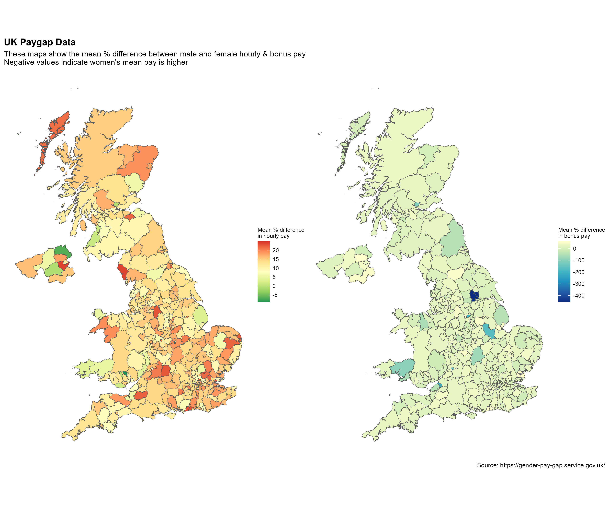

## UK Pay Gap data

This dataset is part of a [#TidyTuesday](https://github.com/rfordatascience/tidytuesday/tree/master/data/2022/2022-06-28) project in 2022. I found it interesting to revisit because I wanted to challenge myself with a choropleth map.

### Methodology

The dataset has almost 49,000 entries across 27 variables for each of the companies that made a submission. I chose to focus on the mean values in difference between hourly and bonus pay across genders for each entry. 

To do this, I took the relevant mean values and post codes and essentially performed a lookup with a separate dataset of UK postcodes to obtain the local authority names. This dataframe was combined with a shapefile of UK local authorities. I was then able to summarise the data using the mean value in the differences per local authority. 

### Limitations

This approach does have limitations, specifically by using mean values per local authority results in data that is not standardised. Neverthless, the intention of this small project was to put together a visualisation rather than conduct an in-depth analysis of the data. 

### Visualisation

The resulting visualisation was put together using [ggplot2](https://ggplot2-book.org/index.html) and [patchwork](https://patchwork.data-imaginist.com/). The full code is available [here](https://github.com/tangandhara/Portfolio/blob/main/UK%20Pay%20Gap/Uk%20Paygap.R).

